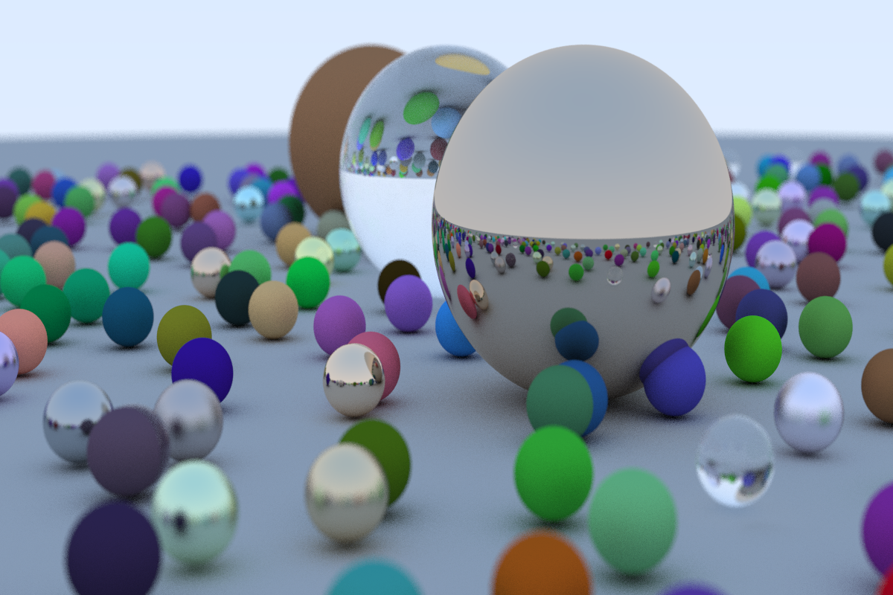

 Output from final chapter
## About

I was reading through [_Ray Tracing in One Weekend_](https://raytracing.github.io/books/RayTracingInOneWeekend.html) and [_Programming Massively Parallel Processors_](https://books.google.com/books/about/Programming_Massively_Parallel_Processor.html?id=wcS_DAAAQBAJ) at the same time and thought raytracing would lend itself well to parallel programming. I would implement chapters of Shirley's book and then use [this NVIDIA blog post](https://developer.nvidia.com/blog/accelerated-ray-tracing-cuda/) to see how I could have written it better. Overall I thought this was a great CUDA learning experience. 

## Build and Run
I compiled this on Ubuntu 20.04 using nvcc version 10.01. I included a simple makefile so simply running
```console
make
```
should work and can then be ran with
```console
./main > out.ppm
```
This was ran on my laptop GPU, a Quadro T2000.

## Future Work

I hope to extend this project to include the sequels [_Ray Tracing: The Next Week_](https://raytracing.github.io/books/RayTracingTheNextWeek.html) and [_Ray Tracing: The Rest of Your Life_](https://raytracing.github.io/books/RayTracingTheRestOfYourLife.html).
